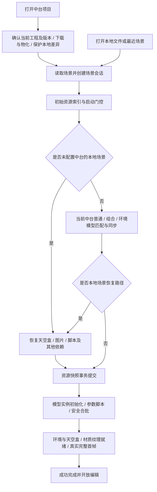
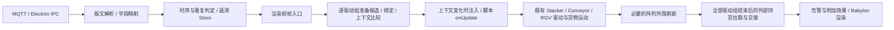

# 数字孪生编辑器极致性能优化方案与实施计划

编制日期：2026-09-11  
核查基线：`C:\temp\babylon-3d-plus`，Git 提交 `82b8c80`，本机 Babylon.js `9.12.0`。  
文档性质：方案与计划。首次编制仅核查代码、配置及已有文档；后续实施与验证见 [实施记录](docs/extreme-performance-implementation.md)。

## 1. 目标、范围与基本判断

本方案覆盖四项工作：加快编辑器打开项目场景和本地场景；提升完整场景的 FPS 与操作流畅度；优化手动漫游及人物模型；查明接入数据、开启动作后的 FPS 下降原因并制定优化措施。

总体路线为：**先建立真实业务场景基线，再消除重复准备、重复扫描和无效更新，最后按 CPU、GPU、网络、内存的实测瓶颈分别优化。** 优先扩展现有加载器、缓存、合批、漫游和性能报告，不新增另一套运行时。

“极致性能”不能解释为任意硬件、任意模型规模下保证 60 FPS。完整原模型的几何、像素、骨骼和透明效果都有成本；优化目标必须绑定硬件、场景版本、镜头路线、分辨率与动作规模。接入数据后的下降也不能直接归因于 MQTT 或动画算法，必须区分消息处理、脚本更新、货物管理、渲染提交和 GPU 工作量。

### 1.1 不可改变的兼容边界

| 范围 | 必须保留的行为 |
| --- | --- |
| 打开逻辑 | 保留中台项目、项目目录、本地场景文件、最近场景的入口区别；不擅自改变默认打开内容、项目绑定与历史版本选择规则 |
| 模型同步 | 保留普通、组合、环境模型的权威来源确认、稳定资源 ID、包内路径匹配、修订检查、下载校验和事务替换；既有强制重新下载/覆盖入口不能被普通缓存命中绕过 |
| 本地场景 | 已配置中台时继续同步当前中台中所有匹配的场景引用模型，包括环境，再恢复其他依赖；未配置中台时保留纯本地引用校验/恢复路径；不通过跳过环境或保留错误旧引用提速 |
| 首帧就绪 | 成功完成必须包含当前模型、环境、天空盒、脚本、合批、材质/纹理就绪与真实完整渲染帧；下载 100%、解析结束、蒙版隐藏均不单独代表成功 |
| 错误和取消 | 保留现有成功组/原快照恢复、资源问题展示、重试和显式带问题继续编辑的语义；带问题继续与完整成功分开计量，发布保护继续生效；旧任务不得提交至新场景 |
| 场景完整性 | 保留实体 ID、资产编号、实例参数、Transform、层级、显隐、锁定、事件和业务绑定；保存、重开、SOURCE 与 Viewer 保持既有语义 |
| 合批 | 复用安全合批准入；含自有 `dataDriven.motion` 键的模型继续排除，键值为 `null` 或空对象也不能放行；未知脚本不得强制共享可变状态 |
| 画面与动画 | 主方案保持原始几何、纹理、材质、分辨率、DPR、灯光效果与正常运行动画频率；不采用代理、删面、降低纹理质量或隐藏视锥内模型作为达标手段 |
| 既有脚本 | 沿用现有约束：不修改 `*.model.ts`、`dataDriven.motion`、AnimationGroup 资源和 Stacker/Conveyor/RGV 运动驱动规则；优化外围管理、缓存、调度和诊断 |
| 漫游 | 保留默认/自定义人物、第一/第三人称、现有输入方式、移动速度、跳跃/飞行、坡度/台阶、碰撞、相机遮挡与动画切换语义 |
| 项目隔离 | A → 首页 → B 时取消旧异步任务并释放会话资源，保留磁盘项目、版本、共享缓存、绑定和配置；不以删除历史资源解决内存问题 |

本文后续出现的“暂停某层”“关闭某效果”仅用于隔离副本中的归因实验，不属于最终交付配置。主方案不包含引擎升级、WebGPU 重写、后端改造或实际发布。

### 1.2 建议目标与决策门槛

以下是基线阶段后需要校准的**建议验收目标，不是已经测得的提升，也不是硬件无关承诺**。

| 指标 | 建议目标 | 使用条件 |
| --- | --- | --- |
| 完整打开耗时 | 冷资源场景中位数降低至少 20%，重复打开中位数降低至少 30% | 同场景、相同资源更新策略和网络条件；重复打开不等于允许零下载 |
| 打开尾部卡顿 | 降低端到端 P95 和 >50 ms 长任务总时长，峰值内存不发生无解释增长 | P95 必须有足够样本；少量试跑只报告各次结果和中位数 |
| 完整功能 FPS | 目标设备以 60 FPS、16.67 ms 帧预算为主目标；经基线确认的重载档单独制定 30 FPS、33.33 ms 门槛 | 不用降低质量或限制全景可见内容放行；已有更严格项目门槛继续执行 |
| 漫游开销 | 被确认的碰撞/邻域准备热点 P95 耗时降低至少 30% | 同一路线、速度、碰撞精度、人物与场景状态 |
| 动作附加开销 | 完整动作相对静止在线的可归因 CPU 热点耗时降低至少 30% | 用毫秒评估；不将不同实验组的 FPS 直接相减后当作可相加收益 |
| 回归控制 | 非目标场景不得出现超过测量波动、且可重复的 5% 以上退化 | 同时对比逐帧分位数、数据延迟和内存；接近阈值时增加配对样本 |
| 正确性 | 场景资源、模型身份、运动/货物行为和漫游功能全部通过 | 任一正确性回归即不放行，无论 FPS 是否提高 |

## 2. 当前实现与优化切入点

下表路径相对仓库根目录。行号用于本次核查定位，实施时按函数名重新确认。部分本机源文件无法直接作为文本读取，本次通过无对应未提交差异的 `git show HEAD:<path>` 核查；这类文件以 `82b8c80` 快照为依据，实施前仍需重新检查工作区。

| 模块 | 当前已存在的能力 | 本轮应继续研究的内容 |
| --- | --- | --- |
| `src/editor/panels/ProjectPanel.tsx` | 先完成模型资源事务，再放行初次 Runtime 初始化；本地最新模型同步后恢复其他依赖 | 同事务查询/校验去重，跨进程阶段耗时，避免重复快照和索引准备 |
| `electron/ipc/dataPlatformProjectService.ts` | 项目包处理、资源匹配与同步、差异保护；普通/组合有界并行与环境并行准备 | 下载、解压、校验、物化的关键路径；共享索引锁范围；保留强制覆盖语义 |
| `src/runtime/babylon/AssetLoadScheduler.ts`、`SharedModelAssetCache.ts` | 普通模型加载并发控制、共享不可变源、独立工作实例；空闲模板已有 16 项/128 MiB 预算 | 命中率、等待时间、克隆成本与估算误差；不重复建设模板缓存 |
| `src/runtime/babylon/environmentAssetContainerCache.ts`、天空盒模块 | 环境源容器复用；天空盒已有 Worker 解码与持久缓存 | 环境版本切换驻留预算、缓存失效、天空盒预过滤/GPU 上传阶段成本 |
| `src/runtime/babylon/EntityArrayThinInstanceBatch.ts` | 原 Geometry 合批、空间分片、保守逐实例视锥裁剪、缓冲复用 | 相机持续移动时的边界批次扫描、矩阵上传字节、分片大小与 Draw Call 的平衡 |
| `src/runtime/babylon/SceneRuntime.ts` | 差量同步、独立选区同步、参数局部同步、遥测缓存和运行生命周期 | 仍需全量遍历的宿主集合、参数变体查询、就绪采样与告警准备 |
| `src/runtime/roam/ManualRoamRuntime.ts` | 碰撞分类、局部邻域、代理池、地面射线、自定义人物与异步代次保护 | 静态环境索引重复重建、代理缓冲更新、人物加载和动画生命周期 |
| `src/runtime/babylon/ScenePerformanceMonitor.ts` | CPU/GPU、Draw Call、长任务、1 Hz/最近一分钟报告；编辑器性能运行与 Viewer 诊断 | 真正逐帧分布、阶段归因、监控自身开销；现有 P95 不是逐帧 P95 |

需要特别避免两种重复方案：一是“新增 thin instance、空间分片、天空盒 Worker、候选缓存”，这些已经存在；二是把历史文档中的某次 FPS 或模拟测试结果当作当前业务场景基线。当前代码和本轮实测应优先于旧文档中的历史策略。

**P0 必须先核定的策略差异：** `docs/scene-capacity-performance.md:287` 起写有中台打开时即使修订相同也重新下载覆盖；本次 HEAD 核查中，`dataPlatformProjectService.ts:461/509` 的普通 latest 调用未传 `forceRefresh`，增量模型同步和环境同步仍存在校验后缓存命中，`expectedFiles` 等特定分支才明确强制刷新。因此不能声称当前所有中台模型都必定重新下载，也不能以旧文档为理由在性能任务中擅自改动此策略。M0 应逐入口记录实际请求与参数，明确各入口应保持的同步策略后固定基准；主方案完整保留现有远端确认、校验、强制分支及事务行为，跨打开零下载不作为默认目标。

## 3. 统一性能基线与定位方法

### 3.1 基准场景和运行条件

选择三类实际场景：常用业务场景、大量同源模型/阵列场景、大型环境与持续动作混合场景。记录场景文件哈希、模型版本、实体数、真实 Mesh 数、合批数、活动设备数、货物数和人物资源，确保对照测试使用相同内容。

固定 CPU/GPU、驱动、内存、电源模式、硬件 renderer、显示刷新率、窗口 CSS 尺寸、drawing buffer 尺寸、DPR、相机路线、阴影/效果、数据频率。编辑态、普通运行、性能运行、独立 Viewer、嵌入宿主 Viewer 分开记录，不将不同运行形态混为一组。

加载缓存至少区分：新进程、空应用资源缓存、已有磁盘资源缓存、同 Runtime 容器复用、跨 Runtime 重开。现有脚本的 cold 主要指隔离应用缓存；没有清空 OS 文件缓存时，不能称为物理冷缓存。

建议探索阶段先采集 3 次冷资源打开、10 次重复打开以定位大项；正式端到端 P95 至少使用 30 次独立打开并披露样本量，必要时继续增加。动作/漫游每组先完成资源准备和稳定预热，再采集不少于 60 秒、至少 3 轮配对数据；首次动作和首次人物加载单独记录，不能被预热样本掩盖。

### 3.2 指标口径

| 指标层 | 必须记录 | 解释与限制 |
| --- | --- | --- |
| 打开 | 用户触发至成功完整首帧 `T_ready`、取消耗时、各阶段开始/结束、下载字节和缓存命中 | 并行阶段不可相加代替端到端耗时；报告关键路径和失败/带问题继续的独立结果 |
| 帧 | 连续帧间隔、P50/P95/P99、>33.33 ms 和 >50 ms 帧比例、总帧数/实际时长 | 使用真实逐帧数据；不能从 1 Hz HUD 样本推算逐帧尾部 |
| CPU | 主线程 profile、解析、Store、脚本外围、漫游、活动网格评估、渲染提交、GC 和长任务 | Babylon frame counter 的覆盖范围与整个 renderer 主线程不同；嵌套计时区分包含/独占耗时 |
| GPU | GPU frame time、Draw Call、顶点/三角调用量估算、实例提交数、shader 编译尖峰 | GPU 计时不可用保留 `null`；估算几何调用量不等于真实硬件计数；CPU/GPU 不能机械相加 |
| 数据 | 消息/字节率、重复/乱序计数、队列深度、接收至应用延迟、活动设备/货物规模 | 不能靠丢消息、推迟动作或吞掉业务事件获得 FPS |
| 内存 | Electron 主/渲染进程工作集、JS heap、缓存项/估算字节、容器/骨骼/动画/代理数量 | 显存若无可靠接口，明确标为估算或不可用，不以 JS heap 代替 |
| 保真 | 多角度截图、人物遮挡、动作轨迹、货物身份与交接、保存重开后场景比较 | 截图只能证明相应画面；仍需真实连续帧和业务行为证据 |

沿用 `ScenePerformanceMonitor` 与性能运行入口，拟增加可关闭的阶段计数及固定容量逐帧环形缓冲。采集期间不逐帧 JSON 序列化、输出日志或更新 React；结束后汇总。做“诊断开启/关闭”配对测试，单独报告监控扰动。

### 3.3 根因判定规则

只有当“热点占比显著 → 单变量实验使相应成本变化 → 完整功能恢复后仍改善 → 行为一致”同时成立，才认定优化有效。静态代码中的循环、缓存未命中或重复计算可以作为候选，但不能直接宣称是主因。

若 CPU 高而 GPU 较低，优先看扫描、脚本外围、碰撞、GC 和提交；若 GPU 持续超预算，优先看可见几何、骨骼、像素和渲染 pass；若只在第一次动作尖峰，查资源准备、shader、货物生成和邻接预热；若接同值心跳即下降，先查输入与通知；若漫游静止也周期卡顿，检查碰撞索引和代理刷新。

## 4. 编辑器打开场景速度优化

### 4.1 保持现有调用链

该图描述依赖关系，不要求把独立阶段串行化。普通项目目录入口当前进入空白场景，不能为提速改成自动打开旧场景；其后显式打开场景才进入对应文件加载路径。场景准备后的全库后台同步继续遵循既有规则，不能冒充当前引用资源已同步完成，也不能静默取消它。

关键定位：`HomePage.tsx:426`、`src/App.tsx:78`、`editorStore.ts:5643/5687`、`ProjectPanel.tsx:982`、`SceneViewPanel.tsx:1779/1888/1916`，最终以 `sceneRenderReadiness.ts` 的就绪契约收口。

### 4.2 分项方案

| 编号/优先级 | 实施内容 | 风险控制与验收 |
| --- | --- | --- |
| O1 / P0 | 用同一打开 ID 关联主进程工程包确认、下载、校验、解压、差异保护、索引、模型同步与 renderer 初始化/首帧；补 IPC 等待和准备队列跨度 | 复用已有 `sceneSessionId` 关联关系；两个进程的单调时钟分别计时，不直接相减；得到可解释的关键路径 |
| O2 / P1 | 合并同一准备阶段内等价并发资源请求、正在进行的下载、相同文件校验、索引读取和脚本文本/编译请求；收紧共享库锁到实际提交区间 | 同步前后两次远端一致性确认分别执行，不能复用为一次；不跨来源、资源类型、ID、包内路径、修订、校验/强制刷新/覆盖代次复用；同 ID 提交仍串行，失败不缓存为成功 |
| O3 / P1 | 将网络下载、文件校验/解压、Babylon 解析、主线程实例初始化分别计量；在当前并发窗口基础上做有界对照，选择端到端和峰值内存都合适的配置 | 当前普通加载 4 路、环境独立 1 路，不盲目全局扩大；网络与解码不能共用一个无界 `Promise.all`；取消能清队列、拒绝过期提交 |
| O4 / P1 | 继续优化既有初始化时间片：合并重复的呈现/测量刷新，复用同一最终快照和批次计划；仅对可拆分的外围任务让出主线程 | 不修改脚本内容、执行顺序和实例参数；单个不可中断 Babylon API 调用不能被“分帧”包装假装拆开；打开成功仍等待所有必需内容 |
| O5 / P2 | 对比天空盒下载、解码缓存命中、立方体转换、预过滤、GPU 上传耗时；保持原缓存身份，消除同一打开中的重复准备 | 保持 Float32、分辨率和预过滤质量；不能重复建设已有 Worker；解码命中不代表 GPU 上传已完成 |
| O6 / P2 | 环境源缓存增加引用保护、空闲项与估算字节预算；就绪轮询改为轻量状态/版本计数，避免为了查 ready 反复生成完整性能快照 | 不淘汰活动工作副本仍引用的资源；状态变化可靠失效；最终仍检查当前 URL/修订、脚本、预期合批数与渲染帧 |

优化下载与文件校验时优先保持流式处理，避免把大型环境、工程 ZIP、JSON 快照在主进程和 renderer 中反复全量复制。若校验占主导，复用现有 Worker 与会话缓存，先缩小失效范围；不另开无界线程池。

**不进入默认实施的策略：** 跨打开复用不可变工程包以减少强制下载。它只有在当前下载策略允许、服务端提供可信内容身份、远端仍确认当前目标版本且本地差异保护不变时才可评估；否则会改变既有覆盖行为。即使后续采用，缓存也不能用“可编辑工程目录仍存在”来替代校验，必须覆盖历史回滚和跨项目隔离。

### 4.3 打开验收

覆盖中台最新工程、历史回滚、项目目录、本地文件和最近场景，并区分已配置/未配置中台。无工程版本且无工程包时按原规则进入空项目，不复用旧场景；已有远端版本但 URL 缺失、包损坏或不支持时应报错并保护本地，不能当作空项目成功。每类资源组合包含普通/组合/环境/天空盒、单个模型更新、参数化模型、合批模型、旧来源路径恢复和自定义人物。

正常路径检查资源版本、实体/参数/摆放/绑定、合批拓扑、天空盒与环境真实可见；失败路径检查损坏/缺失资源、网络中断、超时、用户取消及取消后打开 B。首次加载、反复打开、A → 首页 → B 都需记录内存与旧任务回收。任何“保留资源问题并继续”结果单列，不计入完整成功提速样本。

## 5. FPS 提升与场景运行优化

### 5.1 降低 CPU 重复工作

1. **优先测量剩余全量同步。** 现有 `syncSelection()` 和 `syncModelParameters()` 已是局部路径；继续定位不必要的 `SceneRuntime.sync()`、层级扫描、包围盒重算、参数组检索和模型呈现刷新。按实体/模型版本失效，保留未知变更回退全量同步的路径。
2. **复用运行时注册表。** 用模型增删、替换、异步 ready、变体/代理变化维护宿主集合，降低每帧重复数组/条目分配。注册表必须有明确生命周期和失效来源，不能仅以实体数量相同判断内容不变。
3. **只冻结确认静态的内容。** 环境已有冻结与静态阴影策略，重点核查是否重复冻结/解冻和错误失效。移动实体、脚本节点、骨骼、Morph、货物、告警染色和交互材质保持可更新。材质或矩阵冻结必须配套精确解冻路径，不能直接对整个可编辑/漫游场景 `freezeActiveMeshes()`。Babylon 官方明确说明冻结会阻止相应更新，应依据对象生命周期使用：[场景优化文档](https://github.com/BabylonJS/Documentation/blob/master/content/features/featuresDeepDive/scene/optimize_your_scene.md)。
4. **降低只读监控与 UI 成本。** 当前编辑器监控创建处未显式关闭详细 GPU 工作量收集，而 `sample()` 会扫描活动 Mesh、材料、包围盒并生成排序结果。先测采样尖峰，再采用基础统计持续低频采集、详细报告按需采集及版本缓存；保留隐藏 HUD 后仍有最近历史的现有功能。列表、日志、POI 数据仅在相应数据变化时更新，3D 帧频保持。

### 5.2 优化合批、裁剪与 GPU 提交

`EntityArrayThinInstanceBatch.ts:862/1027/2532` 已有空间分片与视锥裁剪。后续优化不是再次加一套分片，而是测量当前分片在“全景旋转、局部漫游、相机静止、单实体移动”中的实际收益。

| 方向 | 具体动作 | 正确性要求 |
| --- | --- | --- |
| 分片大小 | 记录每批实例/几何调用量、边界批次数、Draw Call、裁剪 CPU；对现有阈值做受控 A/B | 分片更细会增加 Draw Call，更粗会增加无效几何；以总帧耗时决定，不只看批次数 |
| 裁剪缓存 | 相机或实例变化时只更新受影响范围；缓存静态变换包围数据，复用候选缓冲 | 使用保守边界；视锥内模型不得遗漏；骨骼/Morph 仍走适合动态变形的保守路径 |
| 矩阵提交 | 量化当前可见布局变化、矩阵上传字节及选择缓冲刷新；按脏区更新，稳定布局复用 | 逻辑实体映射、负缩放、拾取、高亮、移动、删除、撤销重做保持正确 |
| 模板与材质 | 延续经证明安全的源共享，减少完全相同且不可变资源重复驻留 | 参数变体、动画状态、告警颜色与脚本副作用不能串到其他实体 |
| 多 pass 成本 | 分别测阴影、透明物体、图表/视频、轮廓和告警的 pass 与像素成本；避免同帧重复更新相同目标 | 不取消用户已启用效果；静态阴影仍沿用当前失效与重烘焙规则；移动物体不能被错误静态化 |

Babylon 原生 thin instances 在载体可见时通常整批提交，因此项目已有的空间分片和矩阵裁剪有明确作用；实例矩阵变化也需要正确维护缓冲、包围信息与正负 determinant 分组。继续优化时以当前实现为基础：[Thin Instances 官方文档](https://github.com/BabylonJS/Documentation/blob/master/content/features/featuresDeepDive/mesh/copies/thinInstances.md)。

若真实场景已由完整可见几何/像素量主导，CPU 缓存未必显著提高 FPS，应如实报告剩余 GPU 预算。几何简化、低模、LOD、纹理压缩、降低 DPR、改变透明材质、切换阴影质量均不在本方案默认路径中。

### 5.3 FPS 验收

使用全景固定视角、全景持续旋转、局部移动、编辑选中/拖拽、普通运行、数据动作及漫游组合分别对照。保留截图、实际可见实例数和连续帧计数，避免只渲染少量模型时得到高 FPS。帧率受显示刷新率限制时，重点报告帧预算余量和长帧比例，不通过禁用 VSync 获取交付数字。

## 6. 手动漫游与人物模型优化

### 6.1 已确认的实现与候选热点

现有漫游已经按碰撞类别选择局部三角、AABB 与 thin instance 代理；已有有界代理池、邻域筛选、地面射线快路径和人物加载代次保护。默认无骨骼人物已使用 GPU Morph Target，不应误写为“当前每帧 CPU 重建人物顶点”。

以下代码能确认存在重复工作或生命周期风险，但其对真实 FPS 的贡献尚待实测：

| 候选 | 源码依据 | 验证预测 |
| --- | --- | --- |
| 静态环境重复建索引 | `ManualRoamRuntime.ts:1186` 周期调用 `captureScene(scene.meshes)`；`ManualRoamLocalTriangleCollider.ts:99/116` 调用 `indexMesh(mesh, false)`，绕过已有变化判断 | 静态环境、人物静止时仍有索引重建；增大环境三角数会扩大对应周期尖峰 |
| 邻域代理反复分配/上传 | `ManualRoamLocalTriangleCollider.ts:119/346` 刷新邻域并重新构造顶点/索引/法线及应用到 Mesh | 邻域内容不变时仍有分配和上传；复用后对应成本下降 |
| 射线仍遍历大量 Mesh | `ManualRoamRuntime.ts:845/893` 在场景级遍历中通过 `predicate` 筛选候选后求交 | 漫游邻域不变但远处 Mesh 增多时，拾取 CPU 成本仍增长 |
| 人物重复准备 | `SceneViewPanel.tsx:1241` 创建控制器后构造期加载人物，编辑器标记另有容器加载；Viewer 已按 POI 等条件门控 | 无漫游 POI 的场景仍可能发生默认人物准备；双展示实例可能重复读/解码资源 |
| 退出后动画求值 | `ManualRoamRuntime.ts:310` 禁用时隐藏根节点，未在该路径显式暂停当前 AnimationGroup | 用引擎动画计数/profile 确认隐藏后是否继续求值；不能仅凭隐藏就判定已暂停或已泄漏 |

### 6.2 实施方案

**R1 / P1：事件与版本驱动的碰撞索引。** 首次登记建立索引，后续按新增、删除、几何内容、世界矩阵、显隐/碰撞策略变化失效；未变静态环境不重复读取顶点与建立空间桶。不能只把 `indexMesh(..., false)` 改为 `true`：同顶点数的几何更新也必须被识别。缓存失效应接入实际变更入口；无法证明静态的模型保留可靠检查路径。

**R2 / P1：复用邻域和代理缓冲。** 使用场景版本、邻域单元集合和几何版本确定是否需要重建；容量足够时复用 TypedArray 和 GPU buffer，仅更新变化代理。保持现有三角、碰撞半径和预算，不以减少精度提速。人物最大位移、动态门/障碍和跨楼层移动必须触发及时刷新，不能把刷新延迟扩大后产生穿透。

**R3 / P2：统一候选集与射线查询。** 复用碰撞空间索引缩小地面、相机遮挡和实例候选，保留原来的精确求交和最近命中结果。现有 Top-K/邻域缓存继续使用。只有确认场景规模和分布适用后才增加或调整空间树；动态对象需单独更新，不直接给全场景套八叉树。空间结构的适用条件可参考 [Babylon Octree 官方文档](https://github.com/BabylonJS/Documentation/blob/master/content/features/featuresDeepDive/scene/optimizeOctrees.md)。

**R4 / P1–P2：人物加载与动画生命周期。** 无漫游 POI 且当前无需人物时延迟不必要的加载；已有出生点标记和即将使用的漫游人物仍保持原就绪要求。评估标记与控制器复用同一不可变加载源，缓存有界、引用计数明确；每个展示实例的骨骼、Morph、动画组和释放所有权独立。若实测确认退出后仍进行无用动画求值，再按既有退出/重进语义暂停或恢复；不能修改动画资源、播放倍率和片段规则。

**R5 / P2：热路径小对象与人物成本。** 预解析动画片段名称，复用 Vector3/Ray 等临时对象；分别记录骨骼数、活动动画组、Morph 数、材质/纹理、Draw Call 与蒙皮耗时。保留原碰撞子步和步态更新规则；不通过减少子步、动画采样或骨骼数量降低成本。自定义 GLB 的导入、独立目录、保存重定位和发布资源收集继续沿用原链路。

### 6.3 漫游验收

测试默认人物、带骨骼动画 GLB、无动画 GLB；分别执行关闭、开启静止、第一/第三人称、行走、冲刺、跳跃、楼梯、坡道、窄门、墙角、飞行和相机遮挡。组合测试动态障碍、多楼层、负缩放实例、模型替换、持续设备动作与低帧率子步。

结构性目标：静态场景静止且版本不变时，初始化后的环境索引重建和代理几何重复上传为零；真实变化仅使受影响范围失效。重复启停、换人物、退出预览、A → B 后，容器、骨骼、动画组、输入监听、代理和观察者数量回落到稳定基线。人物外观、遮挡、操作与保存/发布重开必须一致。

## 7. 数据接入与开启动作后 FPS 下降分析方案

### 7.1 现有数据与动画链路

主要定位：`src/runtime/mqtt/` 接收与 `deviceTelemetry.ts` 数据归一化；`SceneRuntime.ts:867/4872` 帧入口；`SpecializedTelemetryRuntime.ts:382/404/570` 候选与上下文；`SceneRuntime.ts:4953/7430/7443` 脚本/阵列外围。

现有候选缓存、绑定缓存、标量签名、复杂值兼容比较、诊断去重、脚本编译共用和输送线邻接/行程缓存继续保留。缓存命中后仍可能有多次宿主集合扫描：`SceneRuntime.ts:874` 的 `collectModels()` 每次重建数组/条目；不同驱动组准备和其他扫描路径仍有开销。输入层的稳定序列化和 JSON Path 解析也是候选热点。它们均需与真实动作中的 GPU、货物和脚本成本共同比较。

### 7.2 可归因实验矩阵

| 组别 | 条件 | 用途 |
| --- | --- | --- |
| A | 无数据、动作关闭 | 静态渲染基线 |
| B | 连接数据、同值心跳、动作关闭 | 接收、IPC、解析、在线状态成本 |
| C | 固定变化数据回放、动作关闭 | 字段映射、去重、Store 和订阅通知成本 |
| D | 固定数据回放、完整动作开启 | 排除网络波动后的完整动作开销 |
| E | D 的测试副本，仅隔离详细诊断/日志发布 | 判断观测系统自身成本 |
| F | D 按 Stacker、Conveyor、RGV 分组，再逐步增加活动设备数 | 定位类型与规模增长曲线；交互设备组另测，不能简单相加 |
| G | 已有货物持续运动，与包含首次创建/取放/交接分别对照 | 区分稳定成本和首次动作/货物尖峰 |
| H | D 的测试副本对照告警、火焰、立标等附加效果 | 判断附加 CPU/GPU pass 成本 |
| I | 恢复完整功能、真实数据、诊断关闭 | 交付配置最终验收 |

这些开关若当前不存在，只在隔离回放或宿主测试包装层实现，不改受保护的脚本与运动驱动，也不进入线上默认行为。C/D 必须使用完全相同的报文序列、到达节奏和初始状态，唯一变量为动作开关；真实网络数据另由 I 验收。B/C 关闭动作后的状态与正式运行不同，只用于归因。每组重新建立相同初始状态、货物和时间基准，避免前一实验残留影响下一组。

### 7.3 优化步骤

| 编号/优先级 | 方案 | 保持不变的规则 |
| --- | --- | --- |
| T1 / P0 | 补输入、Store、候选准备、上下文、脚本外围、阵列、告警的分层耗时及调用/分配计数；必要时使用外部 CPU/GC profile | 不每帧打印日志；不把父子阶段重复相加；保留 CPU 与 GPU 两套证据 |
| T2 / P1 | 缓存宿主注册表和参数变体映射，减少 `collectModels()` 数组/条目重建；维护待捕获基线集合 | 模型对象替换、ready、代理/变体、绑定修改可靠失效；每个驱动组边界仍确认资格，前组同步回调对后组的修改当帧生效 |
| T3 / P1 | 若输入占比显著，缓存已校验 JSON Path 分段和可安全复用的快照签名，减少相同字段配置的重复解析/比较 | 保留顺序、previous/current、同毫秒不同内容、复杂对象原位修改、重复心跳在线时间、重连和乱序规则；不能按对象引用相同就认定未变 |
| T4 / P1 | 缩小参数组查找、脚本完成后的网格收集、渲染签名、包围信息和矩阵提交范围 | 不改变 `onUpdate` 与驱动逐帧调用语义；无法证明几何/材质/显隐没变时仍完整刷新；带 motion 模型不因此允许普通静态合批 |
| T5 / P2 | 量化首个动作资源加载、shader、货物创建和拓扑准备，复用现有模板/预热；仅对无业务副作用的准备工作设置预算队列 | 业务动作、到位、取放和交接仍在原时间边界执行；提前准备增加的 `T_ready`/内存须单独报告，不把等待搬到打开阶段后宣称总成本消失 |
| T6 / P2 | 按目标变换/样式版本复用告警包围盒、颜色和只读 UI 数据；缩小订阅通知范围 | 保留告警判断周期、效果渲染频率、清除恢复和宿主主题联动；不共享会造成串色的可变状态 |

Worker 解析或主进程预处理仅在 profile 确认解析是显著主线程瓶颈、且收益超过复制/IPC 成本时进入下一阶段。需要有界队列、取消、保序与积压指标，先定义拥塞处理；不能静默丢弃消息或仅保留最后一条，因为中间消息可能包含取放货、故障、任务切换和其他边沿。

若主要热点最终落在受保护驱动内部，应给出热点证据、外围已消除的成本和剩余帧预算，单列后续范围决策。不得为完成本方案指标偷偷修改运动算法、插值、速度、更新频率或动画资源。

### 7.4 动画行为验收

用同一数据回放逐项比较设备位置/旋转时间序列、动作完成顺序、货物数量和身份、父子归属、取放/收叉顺序、输送线反转/环路、RGV 到位门控、故障停机、断流时原有设备例外及重连恢复。比较需按同一业务时间对齐，浮点误差容差在基线阶段固定，不能要求不同帧调度下数组逐项机械相等，也不能放宽到掩盖轨迹偏差。

覆盖异步 ready、同 ID 换模型、同帧改绑定、嵌套字段原位变化、暂时禁用后恢复、重复开始/结束预览与基线还原。必须同时验证数据应用延迟，避免画面流畅但设备状态明显滞后。

## 8. 分阶段实施计划

### 8.1 里程碑、工作量与交付物

工期为方案级估算，以真实业务资源、目标机器和可重放数据可用为前提；基线完成后按热点裁剪任务。不要求所有候选优化都实现，只实施有收益且不破坏行为的项。

| 阶段 | 工作内容 | 依赖与并行 | 预计工作量 | 阶段交付与退出条件 |
| --- | --- | --- | --- | --- |
| M0 基线与归因 | 统一指标、打开时间线、逐帧采集、动作/漫游回放，评估监控扰动 | 后续全部依赖；可并行准备场景资产和验收轨迹 | 2–3 人日 | 基线报告、可复现操作/命令、资源清单、热点排序；明确每项收益目标 |
| M1 打开链路 | O2–O6 按关键路径选择，先事务去重/准备，再缓存预算/并发调参 | M0 后；可与独立漫游文件并行 | 4–6 人日 | 冷/重复打开对照，资源和首帧契约通过，取消/项目切换无污染 |
| M2 FPS 与场景 | 差量同步、监控开销、裁剪/提交调优、静态失效治理 | M0 后；与 M4 的 `SceneRuntime` 修改串行合入 | 3–5 人日 | 全景/局部/旋转/编辑交互完整画面对照，CPU/GPU 各自瓶颈得到解释 |
| M3 漫游与人物 | 优先 R1/R2，再按证据执行查询、人物加载与生命周期优化 | M0 后独立推进；依赖共享资源改动时等待接口稳定 | 3–5 人日 | 碰撞/人物/操作回归、路线性能、重复启停资源稳定性 |
| M4 数据与动作 | T2–T6 按归因结果选择，保留脚本和驱动，完成固定回放比较 | M0 后；共享注册表与 M2 协调，避免同文件并改 | 4–6 人日 | 消息→动作阶段报告、完整动作帧时改善、货物与时序一致 |
| M5 整体验收 | 组合场景、安装版 Electron、Viewer/宿主、保存重开和长时间资源观察 | M1–M4 必需项全部通过 | 3–4 人日 | 前后对照报告、已通过/未通过矩阵、回退说明和剩余瓶颈 |

合计约 **19–29 人日**。若由 2–3 名工程师分工并有业务验收配合，可按约 2–3 周组织，但不是固定交付日期；资源缺失、目标机器等待或新的正确性问题需重新评估。

### 8.2 并行划分与合入顺序

- 加载负责人：Electron 资源事务、缓存、打开流程及首帧契约。
- 漫游负责人：碰撞索引、邻域、人物资源与控制器生命周期。
- 运行负责人：性能监控、场景同步、合批和遥测外围；M2/M4 共用的 `SceneRuntime.ts` 由同一负责人协调。
- 主集成负责人：统一指标、评审、固定场景对照、保存重开及 Viewer 验收。可能修改同一文件的工作串行，分析和独立测试准备可以并行。

推荐首轮实施顺序：M0 → 同事务去重/碰撞索引复用/宿主数组复用 → 小范围对照 → 按新热点决定是否继续。不要在尚无基线时同时调整加载并发、裁剪阈值、漫游刷新和消息处理，否则无法归因。

### 8.3 回退与停止条件

每项优化独立提交，以内部可回退策略或兼容回退路径验证，避免新增面向用户的复杂性能开关。缓存失效无法可靠识别时回到原计算路径；资源身份、首帧、碰撞或运动行为出现回归时先回退该项，再重新定位。

同一方案连续两次未产生可复现改善，停止堆叠补丁，重新检查瓶颈、输入规模和测量方法。若收益小于噪声或额外内存/维护成本高于收益，则保留原实现并记录结果。

主方案不迁移场景格式，不覆盖原资产，不自动清理磁盘历史。新增派生缓存需带版本和失效机制，关闭优化后原场景仍能正常打开。涉及实际中台发布、外部部署或策略变更时，在实现与验收结果可审阅后按对应流程单独执行。

## 9. 验证计划与现有工具

以下命令为**后续实施时选择执行的工具**，本次文档编写未运行。纯文档不需要构建；代码修改后只运行受影响范围的回归，再按影响面扩展。

| 范围 | 已有入口 | 证明范围 |
| --- | --- | --- |
| 打开与加载 | `npm run test:scene-loading`、`npm run test:local-scene-recovery`、`npm run test:unified-model-sync` | 资源事务、缓存、取消、脚本/天空盒和就绪契约，不直接证明真实打开速度 |
| 中台真实项目 | `node scripts/smoke-real-project-loading.mjs --url <中台地址> --project <项目名称> --cold 3 --warm 10 --profile` | 独立临时工作区的实际打开、CPU 与资源阶段；可用 `--executable` 验证指定安装产物，按场景设置 `--timeout` |
| 本地真实场景 | `node scripts/smoke-scene-open-performance.mjs <完整场景路径> <报告路径> 2` | 真实 Electron 打开、首帧与资源状态；前置构建和参数以脚本说明为准 |
| 合批与场景容量 | `npm run smoke:scene-capacity`、`npm run smoke:editor-performance`、`npm run smoke:reimport-performance` | 合批/实体/矩阵/重导入正确性；全景硬件 FPS 仍须目标场景与目标机器确认 |
| 漫游 | `tests/roam/manualRoamLocalTriangleCollider.test.ts`、`manualRoamCollisionBounds.test.ts`、`manualRoamAvatarRuntime.test.ts`、`manualRoamSceneSession.test.ts` | 碰撞、人物和会话回归；沿用项目匹配的测试 harness，不假定所有 TS 都能裸 Node 执行 |
| 漫游资源与画面 | `tests/roam/manualRoamAvatar.integration.mjs`、`scripts/smoke-manual-roam-occlusion.mjs` | GLB 资源链路与部分遮挡画面，另补真实场景完整漫游路线 |
| 遥测 | `npm run test:telemetry`、`tests/telemetry/telemetryFrameCaching.test.ts` | 缓存、时序、脚本/驱动与交接边界；另补完整数据回放与业务设备规模性能 |
| 类型与产物 | `npm run typecheck`；按影响范围执行对应构建 | 类型、打包及运行入口一致性，不等于业务验收；Electron IPC 变更覆盖两个 preload 入口和安装产物 |

执行脚本前核查当前构建、参数与副作用。测试使用场景副本、独立临时 userData/工作区，保留原文件哈希；不能以修改正式业务数据获取基线，不使用放宽 FPS 阈值的诊断参数作为发布放行依据。

后续需要补充的验证能力：跨进程统一打开报告、可关闭的逐帧采样、固定业务数据回放、可重放漫游路线、碰撞索引/代理上传计数、缓存与观察者资源统计。这些是拟实施项，不能写成当前工具已经具备。

整体验收至少连续运行 30 分钟，并进行 20 次漫游启停、10 次 A → 首页 → B 循环；具体次数在 M0 根据场景成本调整并记录。关注内存是否趋于稳定、队列是否排空、监听/动画/资源是否回落，不要求浏览器释放后进程工作集立即回到同一字节数。

## 10. 最终交付与完成判定

后续优化完成时应提供：

1. 基线与优化后使用相同条件的报告，包含打开各阶段、真实帧时分布、CPU/GPU、内存和消息应用延迟。
2. 每项优化的实现范围、代码位置、实际毫秒收益、代价、失效条件与回退方式；无收益的试验不进入最终实现。
3. 普通/组合/环境/天空盒与实例参数的完整性证明，保存重开与 SOURCE/Viewer 一致性结果。
4. 默认/自定义人物、碰撞、遮挡和完整漫游路线结果，以及动作轨迹、货物身份/交接和异常恢复结果。
5. 受保护参数脚本与动画资源未变的差异或哈希记录；真实场景尚未达到的目标与剩余硬件/资产瓶颈明确列出。

只有完整功能配置、相同画质、真实目标设备和实际业务场景下同时通过性能与行为验收，才能声明优化完成。构建、NullEngine、模拟消息、局部截图或某一次高 FPS 均不能单独作为完成依据。
